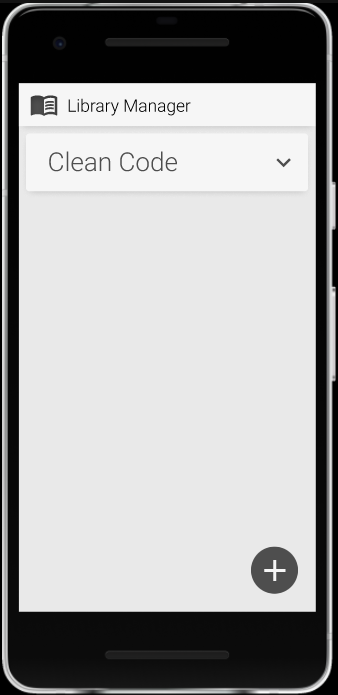
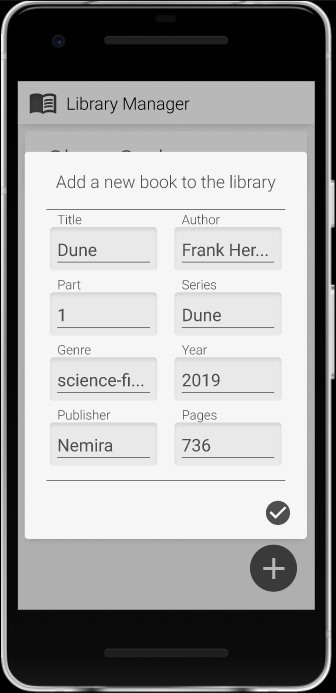
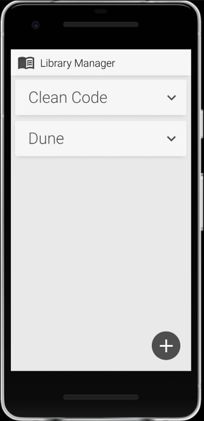
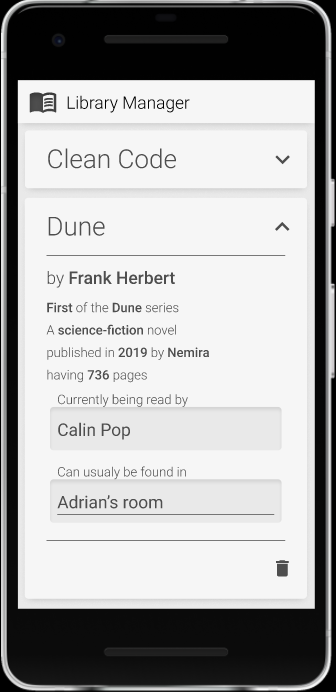

# Library Manager

## Client description:

A mobile application that memorises books from a library.  
It will display all the books from the library, where the books are located normally, who has them in their possesion at the moment.  
It will allow the reader to add a book, to assign and un-assign it to and from a person and to remove it from the library.  

## Domain details:

Entity to store: Book

Entity fields:
- name
- author
- series
- part
- number of pages
- publication year
- publisher
- genre
- current reader
- location

## CRUD:

1. **Create**: The user can add a new book to the database by pressing the `+` button
2. **Read**: The app presents the books as a list on the main pane of the app
3. **Update**: The user can update the current reader and location of any book
4. **Delete**: The user can delete any book by pressing the `trash` button located on the side of the book representation in the list

## Persistence:

- Adding a new book will create a book and will add it to the server-side database and the local one
- Displaying the list of books will require a syncronization of the local database to the server-side database and a request from the local database of all the stored books
- Updating the current reader and location of a book will be done by modifying the corresponding book entity from the server-side database
- Deleting a book will be done by removing that book from the server-side database

## No server access:

When the device si offline, the local database is used instead and whe the connection to the server is restored, the local database is being synced with the sever-side database

## Graphical user interface design:

[Figma project](https://www.figma.com/file/xXgH1JvNTjQV5ZRoAJQXSi/Library-Manager?node-id=0%3A1)

